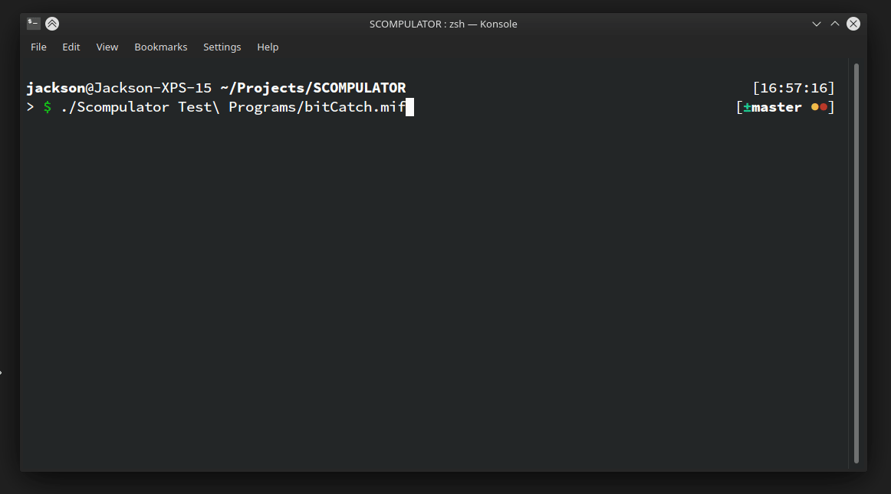
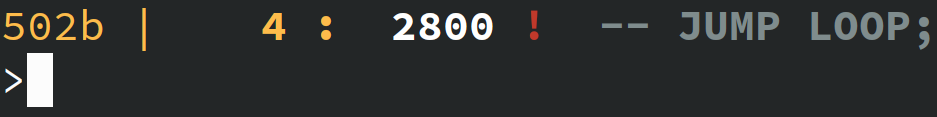

Scompulator
===========

Scompulator is a development and debugging tool designed to work with SCOMP assembly language used in the ECE-2031 course at Georgia Tech. It supports single-stepping, breakpoints and incorporates a number of checks designed to catch common coding errors.

Scompulator is currently in alpha. There are probably very many bugs and edge cases where it doesn't precisely match the behavior of the VHDL implementation. However I do feel that there is enough useful functionality here to genuinely be useful as a debugging tool, even at this early phase.

Installation
============
The only release at the moment is a Linux binary. Windows users should have no problem using [Windows Subsystem for Linux](https://docs.microsoft.com/en-us/windows/wsl/install-win10) to run scompulator. Native support for Windows, and possibly other platforms, is only limited by the need for someone to take the initiative to become a maintainer.

Usage
=====
Scompulator is a purely command-line tool distributed as a single binary file. To use, run the program supplying the name of the mif file to be debugged as the only argument.

`./Scompulator example.mif`

The central feature of the Scompulator is the command prompt. The meaning of the various fields is explained below:

* `[502b]` Current value of the of the AC register
* `[4]` Current value of the of the Program Counter. This value is color coded, Yellow indicates a memory region holding instructions, blue indicates a memory region holding data, grey indicates a memory address with unknown usage
* `[2800]` Numerical value of this memory location
* `[!]` Breakpoint indicator. An exclamation point indicates a breakpoint at this address
* `[-- JUMP LOOP;]` Comment read in directly from the provided MIF file

A list of SCOMPULATOR commands and general usage information can be accessed by typing `help` a the command prompt. All output is in hexidecimal at the moment. Hexadecimal values can be input by prefacing the value with `0x`. For example, to enter hexadecimal 100 type `0x100`. 

Building
========
The only environment that Scompulator has been built in so far is Arch Linux with GCC 10.2.0. Scompulator does use several C++11 features so you will need to have a reasonably up to date compiler. It doesn't do anything platform-specific or leverage any non-standard libraries so the sky's the limit as far as portability. If you make it work please update these instructions.

Windows
-------
I tried it but I couldn't get Microsoft's C++ compiler to behave. It should work as soon as someone with more patience writes some instructions and fixes my awful makefile. For now just use WSL.

OSX
---
Probably same as Linux IDK

Linux
-----
You'll need GCC, make and not much else. If you want to use a compiler other then GCC/G++, change the appropriate field in the makefile. If you've got everything squared away, all you should have do is `cd` into the directory and run `make`

Troubleshooting/FAQ
===================
My screen is full of garbage characters
--

Your terminal probably doesn't support [ANSI escape codes](https://en.wikipedia.org/wiki/ANSI_escape_code). Scompulator makes extensive use of ANSI escape codes for output coloring and related functions. If you're on Windows, try switching to Windows Power Shell.

I found a bug
=============
Put in an issue request on Github. If I'm in a coding mood I'll try and take a look at it.